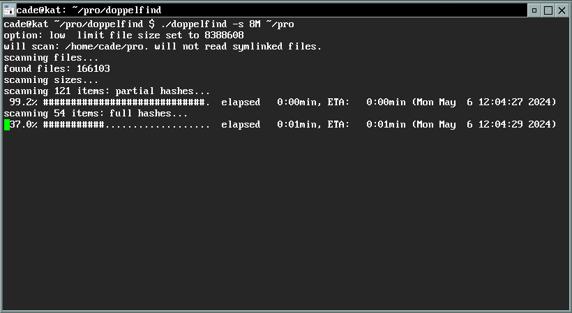

# NAME

DOPPELFIND is file duplicates searching utility written in Perl

# SYNOPSIS

    doppelfind <options> dir1 dir2 dir3...

# OPTIONS 

    -s size   -- low  size limit. files below this size will be ignored
    -S size   -- high size limit. files above this size will be ignored
                 allowed suffixes are K, M, G.
    -l        -- follow symlinked directories
    -v        -- verbose information
    -x        -- print duplicate files' names in hex byte stream 
                 (for machine reading. note that filenames may be in utf-8)
                 
    -p size   -- set size for partial read for partial hash compare.
                 default is 4K. allowed suffixes are K, M, G
    -P        -- enable extended partial hash strategy. if not specified
                 only first data from file is read (can be changed with -p)
                 if -P specified also data from 2/3rds inside the file will
                 be also read and hashed.

    -np       -- disable partial-hash compare
    -nf       -- disable full-hash compare
    
    --        -- end of options, the rest are directory names list
    
# NOTES

    * options cannot be grouped: -Ps is invalid, correct is: -P -s 1G
    * files are compared by SIZE+SHA1, not full content compare
    * if Time::Progress is available, ETA and elapsed time stats are printed
    * distributed under GPLv2 license

# REQUIREMENTS

Doppelfind needs:

    * perl
    * Data::Tools module
    * Time::Progress module (optional, to display work progress and ETA)
    
to install requirements on Devuan or Debian, do as root or with sudo:

    apt install perl
    cpan Data::Tools Time::Progress

# AUTHOR

    2021-2024 (c) Vladi Belperchinov-Shabanski "Cade" 

    <cade@noxrun.com> <cade@bis.bg>

    http://cade.noxrun.bg/projects/doppelfind/

    https://github.com/cade-vs/doppelfind

# LICENSE

Distributed under the GPLv2 license, see COPYING file for the full text.
